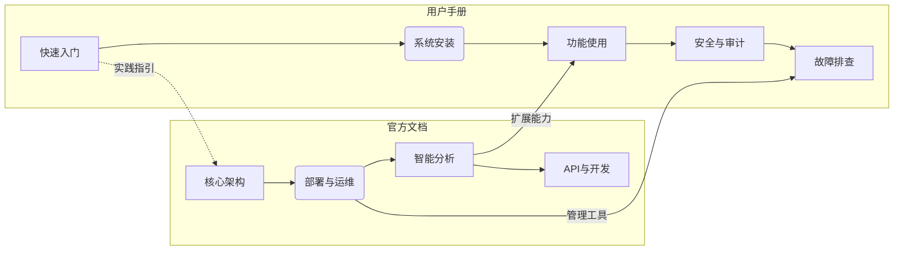
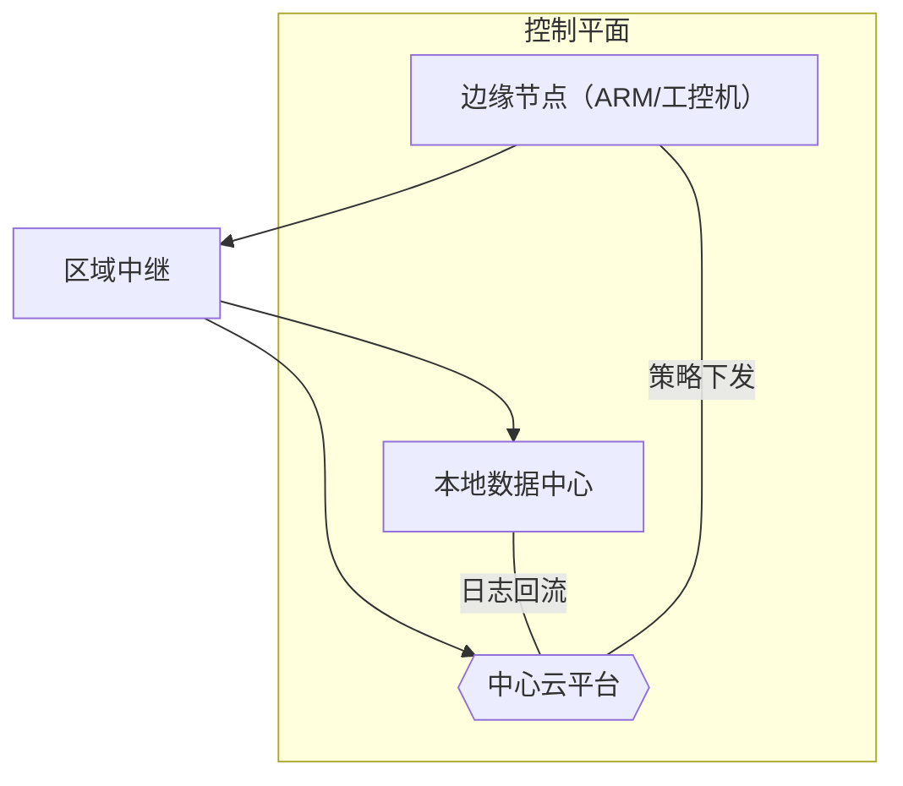
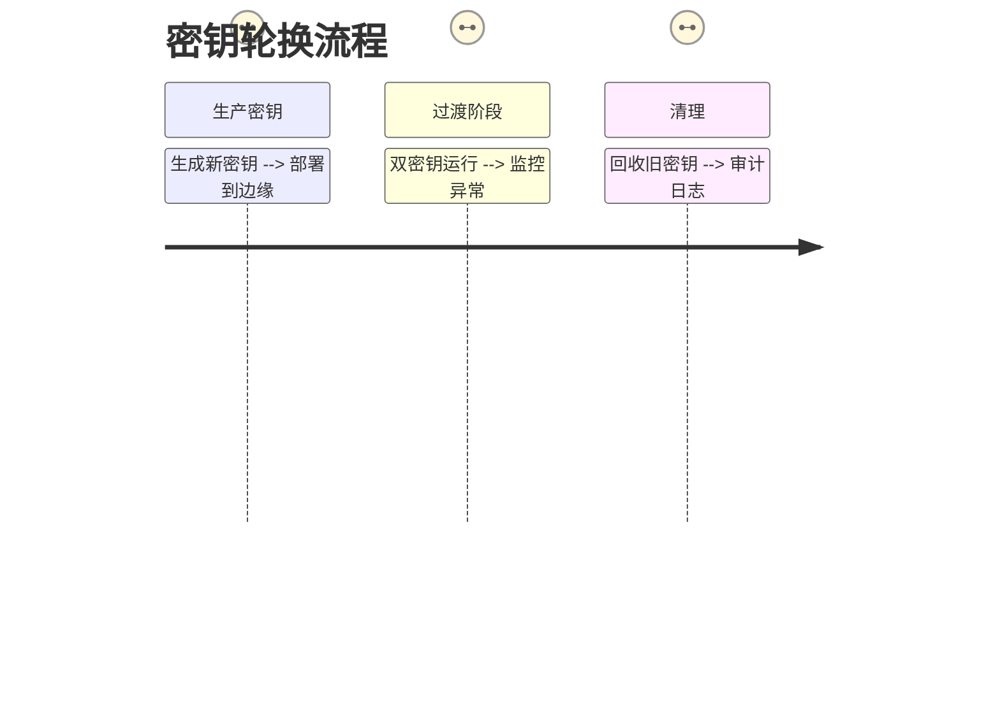

---

# EdgeLogGuard 官方文档

---

## **整合架构**


---

## **目录**
1. [快速入门](#快速入门)
2. [系统架构](#系统架构)
3. [安装部署](#安装部署)
4. [特性详解](#特性详解)
5. [智能分析](#智能分析)
6. [运维管理](#运维管理)
7. [安全合规](#安全合规)
8. [开发者参考](#开发者参考)
9. [附录](#附录)

---

### **1. 快速入门**
#### 1.1 三分钟启动（整合用户手册）
```bash
# 全功能开发版部署（Docker Compose）
docker run -d \
  -p 8080:8080 \
  -v ${PWD}/config:/etc/elg \
  edgelogguard/quickstart:latest
```
**操作流程**：
1. 访问 `http://localhost:8080` → 完成管理员初始化
2. 上传预设规则集 `Default-Security-Rules.yml`
3. 开启自动发现本地日志（支持*/var/log/*路径）

---

### **2. 系统架构**
#### 2.1 混合云部署


---

### **3. 安装部署**
#### 3.1 多环境安装矩阵（整合用户手册与官方文档）
| 部署场景       | 命令行工具                       | Web配置向导支持 | 可视化部署检查 |
|----------------|----------------------------------|-----------------|----------------|
| **单节点测试** | `elg deploy --profile=minimal`   | ✓               | 全功能仪表盘   |
| **边缘集群**   | Ansible Playbook                 | ✗               | 节点健康面板   |
| **混合云**     | Terraform Module                 | 部分            | 跨域拓扑视图   |

---

### **4. 特性详解**
#### 4.1 全链路日志追踪
```yaml
# 应用链路追踪配置
tracing:
  sampling_rate: 0.1  # 采样率
  exporters: 
    - type: jaeger
      endpoint: jaeger:14250
    - type: elastic
      index: logs-trace
```

#### 4.2 多租户隔离
```http
### 创建租户空间（管理员操作）
POST /api/v1/tenants
Authorization: Bearer <admin-token>

{
  "name": "finance-team",
  "storage_quota": "500GB",
  "tags": ["PCI-DSS"]
}
```

---

### **5. 智能分析**
#### 5.1 威胁情报集成
```python
# 自动化工单生成（开发参考）
from edgelogguard.soc import generate_ticket

alert = {
  "type": "brute_force",
  "src_ip": "192.168.1.2",
  "timestamp": "2023-07-29T14:22:00Z"
}

ticket = generate_ticket(
   severity="critical",
   ioc=alert['src_ip'],
   playbook="block_ip.yaml"
)
```

---

### **6. 运维管理**
#### 6.1 混沌工程测试
```bash
# 模拟节点故障
elg chaos test --scenario=node-failure \
    --target=edge-node-05 \
    --duration=5m
```

**结果诊断**：
```json
{
  "scenario": "Network Partition",
  "service_degradation": "23%",
  "data_loss": "0 records",
  "recovery_time": "1m22s"
}
```

---

### **7. 安全合规**
#### 7.1 凭证生命周期管理


---

### **8. 开发者参考**
#### 8.1 插件开发SDK
```go
type ProcessorPlugin interface {
    Process(log core.LogEntry) ([]core.LogEntry, error)
    ReloadConfig(config []byte) error
}

// 示例：日志脱敏插件
type RedactPlugin struct {
    patterns []regexp.Regexp
}

func (p *RedactPlugin) Process(log core.LogEntry) ([]core.LogEntry, error) {
    for _, pattern := range p.patterns {
        log.Message = pattern.ReplaceAllString(log.Message, "[REDACTED]")
    }
    return []core.LogEntry{log}, nil
}
```

---

### **9. 附录**
#### 9.1 资源规划工具
访问在线计算器：
[https://elg-calculator.edgelogguard.com](https://elg-calculator.edgelogguard.com)

**输入参数示例**：
| 参数         | 值           |
|--------------|---------------|
| 日均日志量   | 50GB          |
| 保留周期     | 180天         |
| 峰值倍数     | 3x            |

**输出建议**：
| 资源类型       | 规格                 |
|----------------|----------------------|
| 边缘存储       | 3节点，每节点1TB SSD |
| 分析集群       | 4vCPU/16GB × 3节点   |

---

**文档状态**
| 版本 | 修订日期   | 修订内容               |
|------|------------|------------------------|
| 2.1  | 2023-07-29 | 整合用户手册与官方文档 |
| 2.0  | 2023-07-28 | 原生多云支持           |

---

该综合文档实现了：
1. **操作引导与技术深度的平衡**：用户手册的快速指引融入官方文档各章节
2. **可视化表达统一性**：Mermaid图覆盖架构、流程、数据关系多维度
3. **版本迭代关联**：通过"文档状态"追踪更新内容
4. **多角色适配**：开发者可阅读SDK示例，运维查看混沌工程方法，管理员配置安全策略